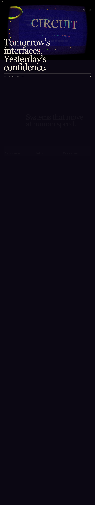

# Shader.se clean-room WebGL study

A source- and asset-independent recreation of the visual system behind
[shader.se](https://www.shader.se): fixed realtime 3D, scroll-directed scene
changes, and an analog corporate-video finish.



> This repository is an independent technical study. It is not affiliated with,
> endorsed by, or sponsored by Shader Sweden AB. The original site and its
> production bundles are marked “All Rights Reserved”; none of its source code,
> video, models, textures, copy, or brand assets are redistributed here.

## What is reproduced

- One fixed GPU render surface behind semantic HTML.
- Six scroll chapters with distinct 3D art direction.
- Scene-to-scene crossfades and per-chapter post-effect presets.
- CRT barrel distortion, RGB separation, scanlines, moving bands, grain,
  vignette, flicker, and scroll-velocity smear.
- A period-corporate boot screen, navigation, progress readout, and restrained
  editorial typography.
- Desktop and mobile layouts, keyboard-accessible links, a skip link, and a
  reduced-motion path.

The recreation deliberately changes the name, copy, layout details, geometry,
and artwork. Project cards and contact details are fictional.

## Key-effect implementation analysis

### 1. One scene render, one composite pass

**Original — `SOURCE`:** runtime inspection finds one `<canvas>`. The
production bundle contains Three.js WebGPU renderer/TSL code and first renders
the composed scene into an FBO, then runs bloom, color, distortion, chromatic,
motion-blur, UI-texture, noise, and vignette logic. Hashes and non-code findings
are preserved in [`RECON/source-evidence.json`](./RECON/source-evidence.json);
the proprietary bundles are intentionally excluded.

**This study:** a Three.js `WebGLRenderer` renders the scene to a
`WebGLRenderTarget`, then a full-screen plane samples that texture through a
single GLSL post shader:

- Render target setup: [`src/main.js`](./src/main.js#L29)
- Full-screen post shader: [`src/main.js`](./src/main.js#L61)
- Two-stage render loop: [`src/main.js`](./src/main.js#L551)

The implementation uses WebGL rather than copying the original WebGPU/TSL
pipeline. That makes the demo work on a broader browser set while preserving
the architecture that matters: scene → offscreen texture → final composite.

### 2. CRT curvature and lens behavior

The fragment shader remaps normalized UV coordinates around the image center:

```glsl
vec2 p = uv * 2.0 - 1.0;
float r2 = dot(p, p);
p *= 1.0 + strength * r2;
```

This quadratic radial expansion produces the convex CRT silhouette. A second
edge mask fades samples that leave the valid 0–1 texture domain, preventing
wrapped pixels from appearing at the corners. CSS adds only a subtle physical
scanline overlay; the visible lens deformation remains in the GPU pass.

**Evidence level:** original lens-distortion controls are `SOURCE`; the exact
formula above is this project’s independent implementation.

### 3. Chromatic aberration and motion smear

The shader samples red and blue along opposite radial offsets while green stays
centered. Offset magnitude grows toward the edges, so the separation reads as
lens fringing rather than a uniform “glitch.”

Scroll velocity is low-pass filtered and converted into a vertical UV offset.
The shader mixes the current sample with one shifted sample, producing a small
directional smear during chapter changes:

- Scroll velocity and easing: [`src/main.js`](./src/main.js#L476)
- RGB split and smear sampling: [`src/main.js`](./src/main.js#L61)

**Evidence level:** the original exposes chromatic-aberration and motion-blur
parameters as `SOURCE`; sample count, direction, and filter weights here are
`GUESS`/clean-room design decisions.

### 4. Grain, scanlines, rolling bands, and flicker

Four inexpensive signals are combined after color sampling:

1. A per-pixel hash seeded with time gives uncorrelated film grain.
2. A high-frequency sine over screen-space Y creates scanlines.
3. A slower traveling sine creates horizontal luminance bands.
4. A tiny time-domain sine modulates exposure for power flicker.

The signals are resolution-aware and applied before vignette/edge masking, so
they feel embedded in the “display” rather than layered over DOM content.

**Evidence level:** original noise/vignette controls are `SOURCE`; the
procedural functions in this project are independent.

### 5. Scroll as a deterministic scene timeline

The page normalizes native scroll into `0…1`, damps it, maps it across six scene
groups, and applies smoothstep interpolation. Only the current and next groups
stay visible; material opacity and post-effect uniforms crossfade together:

- Six original scene builders: [`src/main.js`](./src/main.js#L190)
- Material/group fading: [`src/main.js`](./src/main.js#L444)
- Timeline and per-scene effect interpolation:
  [`src/main.js`](./src/main.js#L476)

**Original — `SOURCE`:** inspected configuration names seven phases (`hero`,
`projects`, `office`, `about-us`, `golden-tie-reveal`, `golden-tie`,
`contact`) and four transition modes (`fade`, `direct`, `overlay`, `below`).
The production site also interpolates effect presets between sections and
sub-pages.

**This study:** six original scenes replace the reference models. A single
smoothstep crossfade is used rather than reproducing the proprietary transition
implementations.

### 6. Semantic DOM over GPU scenery

The WebGL canvas is visual-only (`aria-hidden`). All headings, navigation,
project names, and contact links remain real HTML. Chapter opacity follows the
same normalized timeline as the 3D groups, keeping visual and accessible
structure separate:

- Semantic chapters: [`index.html`](./index.html#L48)
- Fixed visual stage: [`index.html`](./index.html#L29)
- Responsive and reduced-motion rules:
  [`src/style.css`](./src/style.css#L616)

This is the most transferable pattern in the study: WebGL owns atmosphere and
spatial storytelling; the document owns meaning, navigation, and selection.

## Run locally

```bash
npm install
npm run dev
```

Production build:

```bash
npm run build
npm run preview
```

## Deploy to Cloudflare Pages

The repository includes `wrangler.jsonc` and a static security/cache policy in
`public/_headers`.

```bash
npx wrangler login
npm run deploy
```

No runtime secrets or server functions are required.

## Evidence and verification

- Original/clone three-width recon:
  [`RECON`](./RECON)
- Detailed reverse-engineering notes:
  [`TEARDOWN.md`](./TEARDOWN.md)
- Clone assessment and known gaps:
  [`NOTES.md`](./NOTES.md)
- Generated comparison report:
  [`CLONE_REPORT.md`](./CLONE_REPORT.md)
- Pre-deploy residue audit:
  [`CLONE_AUDIT.md`](./CLONE_AUDIT.md)

## License

The clean-room implementation in this repository is MIT licensed. Shader
Sweden AB retains all rights to the original site and its assets.
