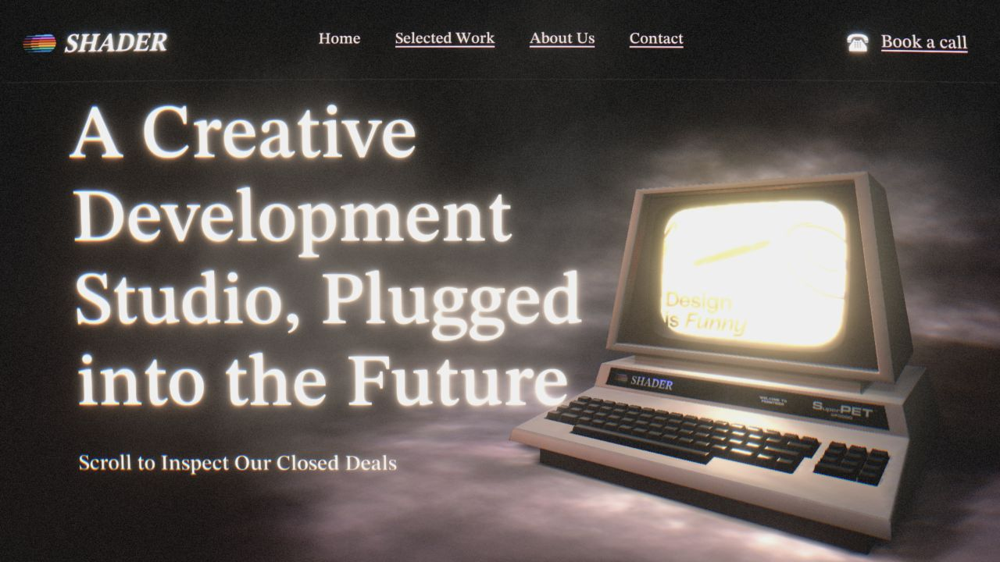
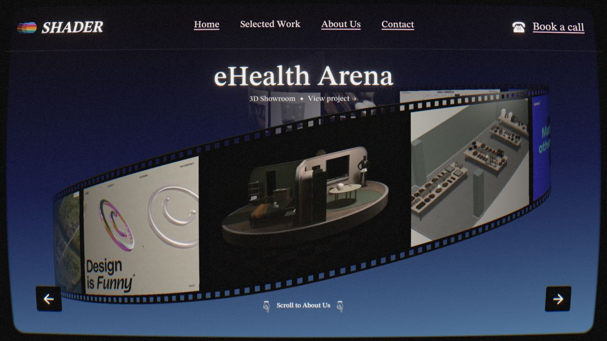
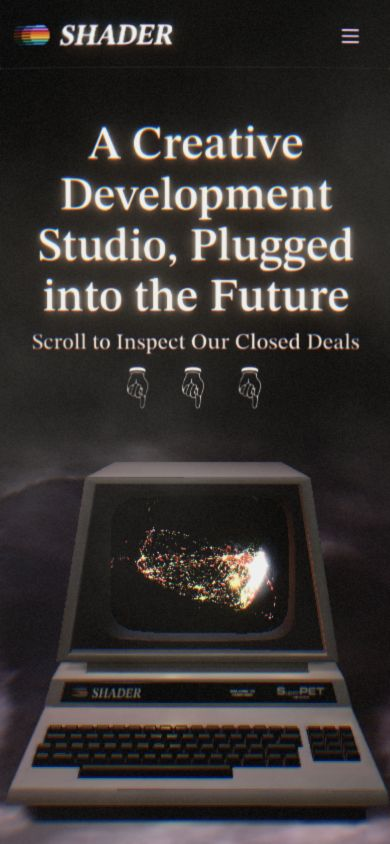

# Shader.se 实时镜像

这是 [Shader Development Studio](https://www.shader.se/) 的同源、响应体无损
实时镜像，部署在 Cloudflare Pages。

**镜像地址：** [shader-se-clone.pages.dev](https://shader-se-clone.pages.dev/)

**上一版 clean-room 复刻：**
[`clean-room-recreation`](https://github.com/Creative-Web-Refs/shader-se-clone/tree/clean-room-recreation)

> 本镜像仅用于独立归档与技术研究，与 Shader Sweden AB 没有隶属、授权或背书
> 关系。上游网站明确标注“All Rights Reserved”。原站代码、美术、视频、商标、
> 文案及其他内容的权利均归 Shader Sweden AB 及相应权利人所有。

## 效果预览

以下截图直接取自当前 Cloudflare Pages 生产镜像。

### 桌面端首屏



### 项目胶片场景



### 移动端首屏

<p align="center">
  
</p>

桌面端截图视口为 1280×720，移动端截图视口为 390×844。三张截图均由同一生产镜像
实时加载，未经过后期合成。

## 核心时间代码阅读版

生产 bundle 已按功能重新命名、格式化并拆成四个便于阅读的文件：

| 文件                                                                | 内容                                                   |
| ------------------------------------------------------------------- | ------------------------------------------------------ |
| [`scene-presets.js`](./docs/effects/scene-presets.js)               | 七个章节的长度、转场类型和完整后处理参数               |
| [`timeline-runtime.js`](./docs/effects/timeline-runtime.js)         | 滚动像素转时间轴、活动页面/场景选择、Navbar 章节跳转   |
| [`effect-timeline.js`](./docs/effects/effect-timeline.js)           | 特效权重、smoothstep、Loading/Subpage/Section 四层插值 |
| [`post-processing-time.js`](./docs/effects/post-processing-time.js) | Clock、Noise 相位、Bloom 呼吸和帧率补偿 Motion Blur    |

从 [`核心时间代码阅读指南`](./docs/effects/README.md) 开始阅读。每段都标明
`SOURCE` / `PARTIAL` / `GUESS`，并由
[`source-map.json`](./docs/effects/source-map.json) 记录生产 chunk 的 URL、SHA-256 和
格式化行号。

如需在本地查看完整格式化生产代码：

```bash
npm run extract:sources
```

结果写入被 Git 忽略的 `.cache/shader-readable/`。仓库只保存语义化阅读版，不直接
发布整份专有 bundle。

## 为什么这一版才是 1:1

上一版使用原创 CSS 和生成素材重新实现了参考站。结构已经接近，但私有 3D 模型、
项目视频、WebGPU shader、转场和精确时间线只能近似。

现在 `main` 使用 Cloudflare Pages 高级模式 Worker 作为透明同源反向代理：

```text
浏览器
  → shader-se-clone.pages.dev/path?query
  → Cloudflare Pages _worker.js
  → www.shader.se/path?query
  → 未修改的响应体
```

镜像在自己的域名下流式转发上游 HTML、Next.js chunks、CSS、字体、纹理、模型、
预烘焙动画帧和路由响应。页面里的相对 URL 会继续经过同一个代理，因此浏览器运行的
就是 `www.shader.se` 当前线上部署的原始客户端。

本地字节比对确认：镜像 `/` 响应解压后与上游响应完全一致。

## 镜像实现

完整实现位于 [`public/_worker.js`](./public/_worker.js)。

每个请求会经过以下步骤：

1. 保留原始 pathname 和 query string。
2. 创建指向 `https://www.shader.se` 的上游请求。
3. 移除 Cloudflare/客户端转发头以及访客 cookie。
4. 非 GET 请求保留 method 和 request body。
5. 不解析、不压缩、不改写响应 body，直接流式返回。
6. 只改写同源 `Location` 重定向，使页面继续停留在镜像域名。
7. 添加 `x-mirror-source` 和 `x-mirror-notice` 响应头。

镜像提供一个不会访问上游的健康检查：

```text
GET /__mirror-health
```

返回当前代理模式及上游地址。

## 关键特效实现分析

这个分支执行的是原站线上客户端，所以下列效果不再是视觉近似，而是原站真实运行时。

### 1. WebGPU / Three.js 场景管线

运行时与 bundle 检查确认，页面使用单个固定 Canvas，并由 Three.js WebGPU/TSL
驱动。当前场景先渲染到离屏目标，再进入后处理合成图。

已观察到的后处理参数包括：

- Bloom；
- Noise 与胶片颗粒；
- Sepia；
- 对比度、亮度和饱和度；
- 镜头畸变；
- Motion blur；
- Vignette；
- Chromatic aberration。

镜像原样转发对应的 `_next/static/chunks/*`，因此 shader 代码、uniform 默认值、
renderer 选择和运行时能力检测均为原站生产实现。

### 2. 滚动驱动的场景状态

生产配置中可确认 7 个阶段：

- `hero`
- `projects`
- `office`
- `about-us`
- `golden-tie-reveal`
- `golden-tie`
- `contact`

同时存在 4 种转场模式：`fade`、`direct`、`overlay`、`below`。原站让浏览器
document 保持视口高度，使用自定义 wheel/touch 时间线，而不是原生页面滚动。

镜像运行原始 chunks 并获取原始场景资源，因此相机曲线、缓动、阶段阈值、
后处理插值和转场重叠均被直接保留，无需重新编写。

### 3. 首屏电脑与 CRT 质感

首屏由以下元素组成：

- 米色复古工作站与键盘模型；
- 动态屏幕纹理；
- 烟雾/云层纹理与地面反射；
- 语义化大标题；
- 同时作用于 3D 与 UI 的 CRT 合成。

显示器画面和环境资产通过镜像使用原始路径加载。生产后处理提供最终画面中的 Bloom、
类扫描线颗粒、RGB 边缘、运动拖影、镜头柔化和暗角。

### 4. 项目胶片轮播

项目轮播不是扁平 DOM。原站将项目媒体贴到弯曲胶片表面，并由项目状态驱动胶片位置
和相机运动。

镜像完整保留：

- Next.js 响应中的项目数据；
- 真实 3D 胶片几何与 shader 材质；
- 前后项目按钮行为；
- 11 个项目状态；
- Mux 播放与 poster 请求；
- 项目详情路由导航。

### 5. 办公室与翻页转场

办公室场景重复使用工作站/隔间几何，形成大面积透视网格。进入 About 时使用场景层级
与弯曲纸张表面，符合生产配置中的 `overlay` / `below` 转场语法。

模型、纹理、相机变换和转场计算全部来自上游；`main` 不再使用 CSS 替身。

### 6. About、星形揭示、金领带与联系页

后半段将 WebGPU 场景、UI 纹理、预烘焙 AVIF 动画帧、照片、人物序列和语义 DOM
混合在一起。镜像转发真实的 `/textures/*`、`/videos/*`、`/fonts/*` 和
Next.js 路由请求，因此完整保留：

- 企业年报印刷布局；
- 客户图形与人物；
- 波纹干涉转场；
- 星形揭示；
- 金色领带反射及人物动画；
- 电话场景；
- 最终联系页与无障碍声明。

### 7. 响应式行为

上游运行时自行渲染桌面/移动端控制与场景取景。镜像没有注入自定义断点 CSS，因此
视口检测、纹理选择、移动端菜单、renderer pixel ratio 以及 touch/wheel 输入逻辑
都与当前生产站一致。

## 分支说明

| 分支                    | 用途                                       |
| ----------------------- | ------------------------------------------ |
| `main`                  | 部署到 Cloudflare Pages 的实时反向代理镜像 |
| `clean-room-recreation` | 使用原创生成素材制作的独立近似复刻         |

上一版的实现、README、生成媒体、截图与完整历史均保留在独立分支，可随时恢复。

## 本地运行

安装依赖：

```bash
npm install
```

启动 Pages Worker 镜像：

```bash
npm run dev
```

本地地址为 `http://127.0.0.1:4180`。

这里不能使用普通 `vite preview`：它只会显示 fallback 页面，不会执行 Pages
Worker。

## 部署

```bash
npm run deploy
```

`wrangler.jsonc` 将 Pages 输出目录指向 `dist`；构建时 Vite 会把
`_worker.js` 复制成高级模式入口。

## 验证结果

- 本地镜像 `/`：`200`
- 根 HTML 解压后：与上游逐字节一致
- 原站 Next.js chunk：`200`
- 原站字体、纹理、AVIF 帧、图标及模型请求：`200`
- 浏览器标题：`Shader Development Studio`
- Canvas 数量：`1`
- Hero 标题：与上游完全一致
- Hero 和项目胶片截图：与原站一致
- 加载及滚动后的 Console error：`0`

早期逆向工作留下的证据保存在 [`RECON`](./RECON)。

## 可用性与隐私说明

- 这是**实时镜像**，不是离线归档。`www.shader.se` 停机或更新时，镜像会同步受到
  影响。
- 正常访问会让 Worker 请求 `www.shader.se` 的公开资产，并运行上游当前使用的
  第三方服务请求。
- 镜像不会把访客 cookie、客户端 IP 或 Cloudflare 转发头发送给上游。
- 镜像不会额外添加分析、存储、登录、表单或追踪逻辑。

## 许可证

仓库中自主编写的镜像 Worker 与 fallback 页面采用 MIT License。该许可证不覆盖
从 `www.shader.se` 流式转发的内容；上游权利和条款保持不变。
